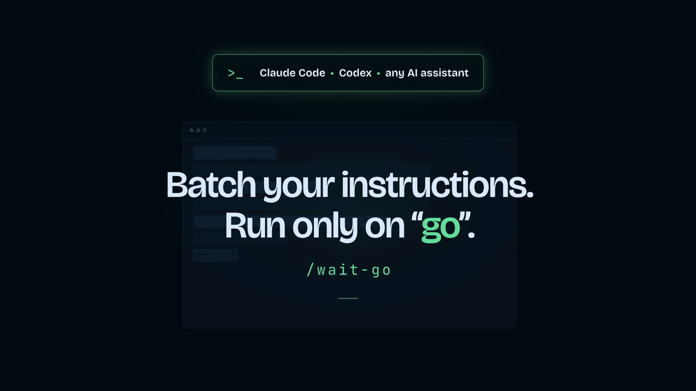

<p align="center">
  
</p>

# WaitGo

> **Batch your instructions, then execute only when you say go.**

Works with Claude Code, Codex, and any AI assistant.

WaitGo is a minimal reusable command that lets you stage several instructions before execution.

Instead of reacting to each instruction immediately, your assistant waits until you write `go`, then processes everything as one consolidated sequence.

## Why?

Sometimes you have several corrections, requests, or implementation notes to send, but you do not want your assistant to start working after the first one.

WaitGo lets you gather your feedback first, trigger execution once with `go`, and let the assistant work through the full sequence while you focus on something else or just go grab a coffee.

## Best for

WaitGo is useful when you want to:

* Queue several corrections, requests, or implementation notes before execution.
* Batch feedback after reviewing a first result.
* Avoid your assistant starting too early.
* Let it reorganize related requests, dependencies, or conflicts before acting.

## How to use

Once installed, trigger it with the form native to your tool:

| Where | Trigger |
| --- | --- |
| Claude Code | `/wait-go` |
| Codex | `$waitgo` |
| Other AI coding assistants | the form created at install time |
| Regular AI chat | paste the chat version into the conversation |

Then send your instructions one by one, and write exactly `go` when you want execution to start.

## What the command does

When you invoke WaitGo, the assistant enters a waiting mode and lets you send several instructions in a row.

Before you write `go`, it does not start any task, modify files, produce a detailed analysis, or propose an execution plan. It only confirms that the instruction has been received and keeps it in the conversation context.

When you write exactly `go`, it rereads all received instructions, groups them into coherent blocks, identifies dependencies, duplicates, ambiguities, or possible conflicts, proposes a clear execution order, and processes the tasks step by step.

Only a message whose entire content is exactly the three lowercase characters `go` triggers execution. `Go`, `GO`, `"go"`, `go.`, or `go` followed by anything else stays a queued instruction.

At the end, it provides a concise summary of what was done, the execution order followed, the files created or modified when the tool can edit files, and any important assumption, limitation, or unresolved point.

## How is this different from a plan mode?

Planning features help the assistant think before acting.

WaitGo is for a different moment: when you already have several corrections, notes, or implementation requests to send, but you do not want it to start after the first one.

It lets you stage all your feedback first, then trigger one consolidated execution with `go`.

## Limitations

WaitGo does not bypass your assistant's permissions.

If it needs approval to read, edit, run, or access something, the usual permission prompts still apply. WaitGo only changes when your assistant starts processing your instructions; it does not change what it is allowed to do.

Queued instructions live in the conversation context, not on disk. If the conversation is compacted, reset, or restarted before you write `go`, the queue can be lost.

## Install in Claude Code

### Method 1: Let Claude Code install it (recommended)

Paste this prompt in a Claude Code session:

[install-waitgo-for-claude-code.md](prompts-for-installation/install-waitgo-for-claude-code.md)

Claude Code asks where to install the command, then creates it. Prefer the global install: WaitGo is a way of working, not project-specific content, so it is worth having in every session.

Then use it with:

```txt
/wait-go
```

### Method 2: Manual

Copy [wait-go.md](.claude/commands/wait-go.md) into `~/.claude/commands/` for all your sessions, or into your project's `.claude/commands/` folder to version it with the repository.

## Install and use in Codex

WaitGo ships as a native Codex skill in [`.agents/skills/waitgo`](.agents/skills/waitgo).

### Method 1: Let Codex install it (recommended)

Paste this prompt in a Codex session:

[install-waitgo-for-codex.md](prompts-for-installation/install-waitgo-for-codex.md)

Codex asks whether to install the skill globally or in the current project only, then creates it. The global install is recommended so WaitGo is available in every project.

Restart Codex or open a new chat, then invoke the skill:

```txt
$waitgo
```

Codex reserves root slash commands and does not support a custom `/waitgo` alias. `$waitgo` is the native reusable form and works across projects.

### Method 2: Manual

Clone this repository, enter it, then link the skill into your user-level skills folder:

```sh
git clone https://github.com/arthurglaizal/wait-go.git
cd wait-go
mkdir -p "$HOME/.agents/skills"
ln -s "$PWD/.agents/skills/waitgo" "$HOME/.agents/skills/waitgo"
```

Codex also discovers user skills under `~/.codex/skills`, but that location is deprecated and kept only for backward compatibility.

For a project-only install, `.agents/skills/waitgo` is already picked up when you work inside this repository.

A legacy custom-prompt file is also kept in [`.codex/prompts/waitgo.md`](.codex/prompts/waitgo.md) for older Codex versions that loaded reusable prompts from `~/.codex/prompts`. On recent versions, use the skill.

## Using with other AI assistants

Claude Code and Codex ship ready-to-use files in this repo. The same behavior can be reproduced with any other AI assistant using the instructions in:

[install-waitgo-for-any-ai.md](prompts-for-installation/install-waitgo-for-any-ai.md)

Paste these instructions into the target assistant to let it recreate the WaitGo behavior in its own supported format. If the assistant supports a user-level location, it asks whether to install WaitGo globally or in the current project only.

## Use in a regular AI chat (ChatGPT, Claude, Gemini…)

If you just want to use WaitGo inside a normal chat, not install it in a coding assistant or project environment, copy this version into a new conversation:

[waitgo-ai-chat-version.md](prompts-for-ai-chat/waitgo-ai-chat-version.md)

It only applies to the current chat. If you start a new conversation, paste it again.

## Repository structure

```txt
wait-go/
├── README.md
├── LICENSE
├── .gitignore
├── .agents/
│   └── skills/
│       └── waitgo/
│           ├── SKILL.md
│           └── agents/
│               └── openai.yaml
├── .codex/
│   └── prompts/
│       └── waitgo.md
├── .claude/
│   └── commands/
│       └── wait-go.md
├── prompts-for-ai-chat/
│   └── waitgo-ai-chat-version.md
├── prompts-for-installation/
│   ├── install-waitgo-for-claude-code.md
│   ├── install-waitgo-for-codex.md
│   └── install-waitgo-for-any-ai.md
└── public/
    ├── waitgo-demo.mp4
    ├── waitgo-1280.gif
    └── waitgo-image.png
```

## Support

If you find this project useful, you can [buy me a coffee](https://ko-fi.com/arturo_ux).

## License

MIT — see [LICENSE](LICENSE).
