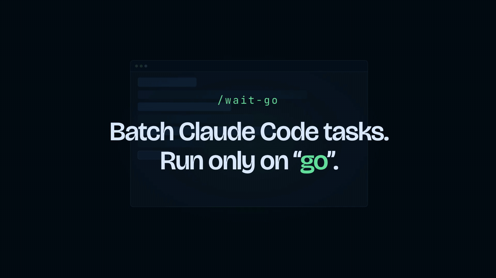

<p align="center">
  
</p>

# WaitGo

> **Batch your instructions, then execute only when you say go.**

WaitGo is a minimal Claude Code slash command setup that lets you stage several instructions before execution.

Instead of reacting to each instruction immediately, Claude Code waits until you write `go`, then processes everything as one consolidated sequence.

## Why?

Sometimes you have several corrections, requests, or implementation notes to send, but you do not want Claude Code to start working after the first one.

WaitGo lets you gather your feedback first, trigger execution once with `go`, and let Claude Code work through the full sequence while you focus on something else or just go grab a coffee.

## Best for

WaitGo is useful when you want to:

* Queue several corrections, requests, or implementation notes before execution.
* Batch feedback after reviewing a first result.
* Avoid Claude Code starting too early.
* Let Claude Code reorganize related requests, dependencies, or conflicts before acting.

## How to use

When you want to stage several requests in a Claude Code session, type:

```txt
/wait-go
```

Note: for other AI assistants, follow the generic installation instructions.

## What the command does

When you run `/wait-go`, Claude enters a waiting mode and lets you send several instructions in a row.

Before you write `go`, Claude does not start any task, modify files, produce a detailed analysis, or propose an execution plan. It only confirms that the instruction has been received and keeps it in memory.

When you write exactly `go`, Claude rereads all received instructions, groups them into coherent blocks, identifies dependencies, ambiguities, or possible conflicts, proposes a clear execution order, and processes the tasks step by step.

At the end, Claude provides a concise summary of what was done, the execution order followed, and the list of files created or modified.

## How is this different from plan mode?

Plan mode helps Claude think before acting.

WaitGo is for a different moment: when you already have several corrections, notes, or implementation requests to send, but you do not want Claude to start after the first one.

It lets you stage all your feedback first, then trigger one consolidated execution with `go`.

## Limitations

WaitGo does not bypass Claude Code permissions.

If Claude Code needs approval to read, edit, run, or access something, the usual permission prompts still apply. WaitGo only changes when Claude starts processing your instructions; it does not change what Claude is allowed to do.

## Install in Claude Code

### Method 1: Copy the command file

Copy [wait-go.md](.claude/commands/wait-go.md) into your project's `.claude/commands/` folder.

### Method 2: Install using Claude Code

You can ask Claude Code to handle the installation. Paste this prompt in a Claude Code session:

[install-waitgo-for-claude-code.md](prompts-for-installation/install-waitgo-for-claude-code.md)

## Using with other AI assistants

This repo is designed primarily for Claude Code. The same behavior can be reproduced with other AI assistants using the instructions in:

[install-waitgo-for-any-ai.md](prompts-for-installation/install-waitgo-for-any-ai.md)

Copy these instructions into your AI chat to reproduce the WaitGo behavior.

## Repository structure

```txt
wait-go/
├── README.md
├── LICENSE
├── .gitignore
├── .claude/
│   └── commands/
│       └── wait-go.md
├── prompts-for-installation/
│   ├── install-waitgo-for-claude-code.md
│   └── install-waitgo-for-any-ai.md
└── public/
    ├── waitgo-demo.mp4
    └── waitgo-poster.png
    └── waitgo-demo-1500w-24fps.gif
```
